<br/>
<p align="center">
  <a href="https://x.com/HermesOneApp"></a>
  <a href="https://discord.gg/Fqu72h8z"></a>
  <a href="https://github.com/fathah/hermes-desktop/blob/main/LICENSE"></a>
  <a href="https://hermesone.org"></a>
<a href="https://github.com/fathah/hermes-desktop/stargazers">
  
</a>
  <a href="https://github.com/fathah/hermes-desktop/releases/">
  
</a>
   <a href="https://bankr.bot/launches/0xfda75f77a22b4f4b783bbbb21915ef64d149bba3">
  
</a>
  
</p>

<p align="center">
  <a href="README.md">English</a> ·
  <a href="README.zh-CN.md">简体中文</a> ·
  <a href="README.ja-JP.md">日本語</a> ·
  <a href="README.es-LATAM.md">Español (LATAM)</a>
</p>

<p align="center">
 <a href="https://www.star-history.com/fathah/hermes-desktop">
  <picture>
   <source media="(prefers-color-scheme: dark)" srcset="https://api.star-history.com/badge?repo=fathah/hermes-desktop&theme=dark" />
   <source media="(prefers-color-scheme: light)" srcset="https://api.star-history.com/badge?repo=fathah/hermes-desktop" />
   
  </picture>
 </a>
</p>

> **This project is in active development.** Features may change, and some things might break. If you run into a problem or have an idea, [open an issue](https://github.com/fathah/hermes-desktop/issues). Contributions are welcome!

Hermes One is a community maintained native desktop app for installing, configuring, and chatting with [Hermes Agent](https://github.com/NousResearch/hermes-agent) — a self-improving AI assistant with tool use, multi-platform messaging, and a closed learning loop.

Instead of managing the CLI by hand, the app walks through install, provider setup, and day-to-day usage in one place. It uses the official Hermes install script, stores Hermes in `~/.hermes`, and gives you a GUI for chat, sessions, profiles, memory, skills, tools, scheduling, messaging gateways, and more.

## Sponsors

> [Want to appear here?](mailto:fathah@hermesone.org)

<details open>
<summary>Click to collapse</summary>
<br/>
<table>
<tr>
<td width="180"><a href="ttps://www.atlascloud.ai/?utm_source=github&utm_medium=link&utm_campaign=hermes-desktop"></a></td>
<td> <a href="https://www.atlascloud.ai/?utm_source=github&utm_medium=link&utm_campaign=hermes-desktop">Atlas Cloud</a> is a full-modal, OpenAI-compatible AI inference platform (DeepSeek, Qwen, GLM, Kimi, MiniMax, and more). Use it in Hermes One by selecting <b>Atlas Cloud</b> as your provider. The base URL is pre-configured automatically. </td>
</tr>
</table>

</details>

## Install

<a href="https://hermesone.org"></a>

<details>
<summary>Windows</summary>
<br/>

> **Windows users:** The installer is not code-signed. Windows SmartScreen will warn on first launch — click "More info" → "Run anyway".

> **WSL users:** If the installer stalls at `Switching to root user to install dependencies...`, Playwright is waiting for a sudo password that has no TTY to read from. Grant passwordless sudo for the install, then revert when finished:
>
> ```bash
> echo "$USER ALL=(ALL) NOPASSWD: ALL" | sudo tee /etc/sudoers.d/hermes-install
> # …re-run the installer; once it finishes:
> sudo rm /etc/sudoers.d/hermes-install
> ```
>
> Tracked in [#109](https://github.com/fathah/hermes-desktop/issues/109).

</details>

<details>
<summary>Fedora (RPM)</summary>
<br/>

```bash
sudo dnf install ./hermes-desktop-<version>.rpm
```

> **Fedora users:** The `.rpm` is not GPG-signed. If your system enforces signature checking, append `--nogpgcheck` to the install command. Auto-update is not supported for `.rpm` builds (limitation of `electron-updater`); reinstall the new `.rpm` to update.

</details>

## Preview

<table>
<tr>
<td width="50%" align="center"><b>Chat</b><br/>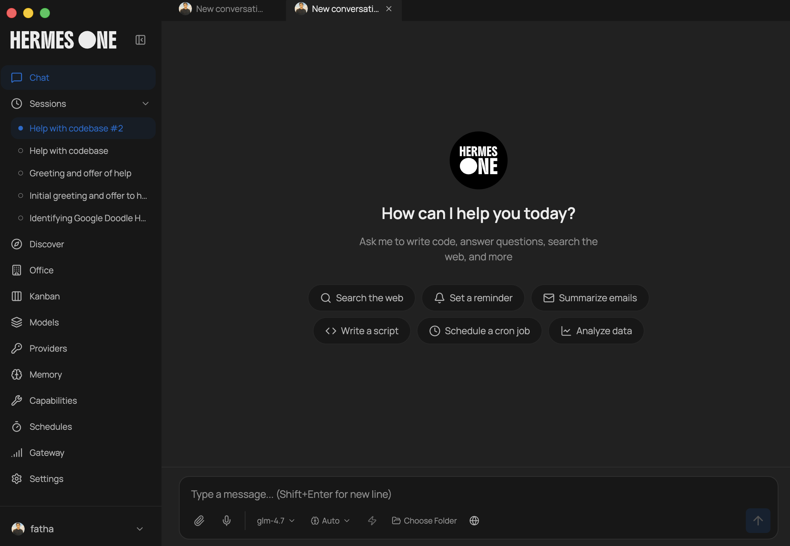</td>
<td width="50%" align="center"><b>Profiles</b><br/>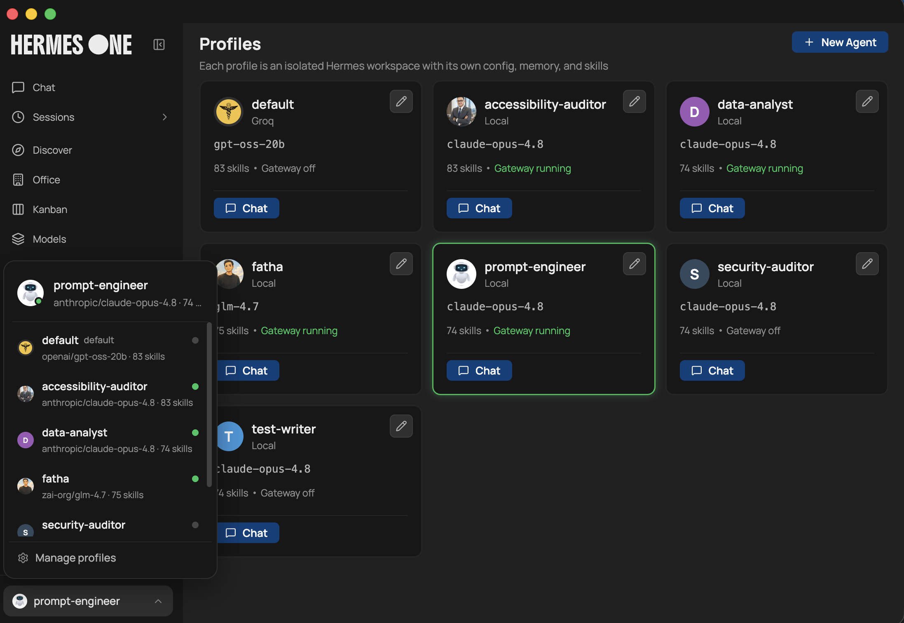</td>
</tr>
<tr>
<td width="50%" align="center"><b>Models</b><br/>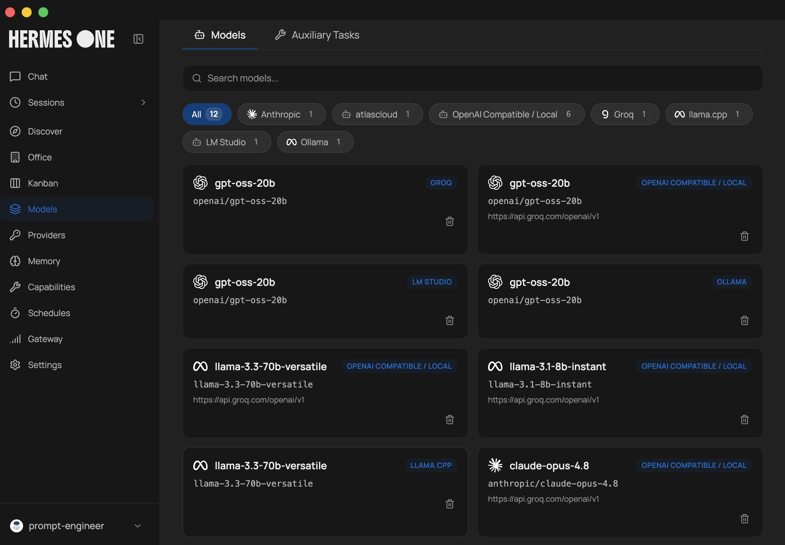</td>
<td width="50%" align="center"><b>Providers</b><br/>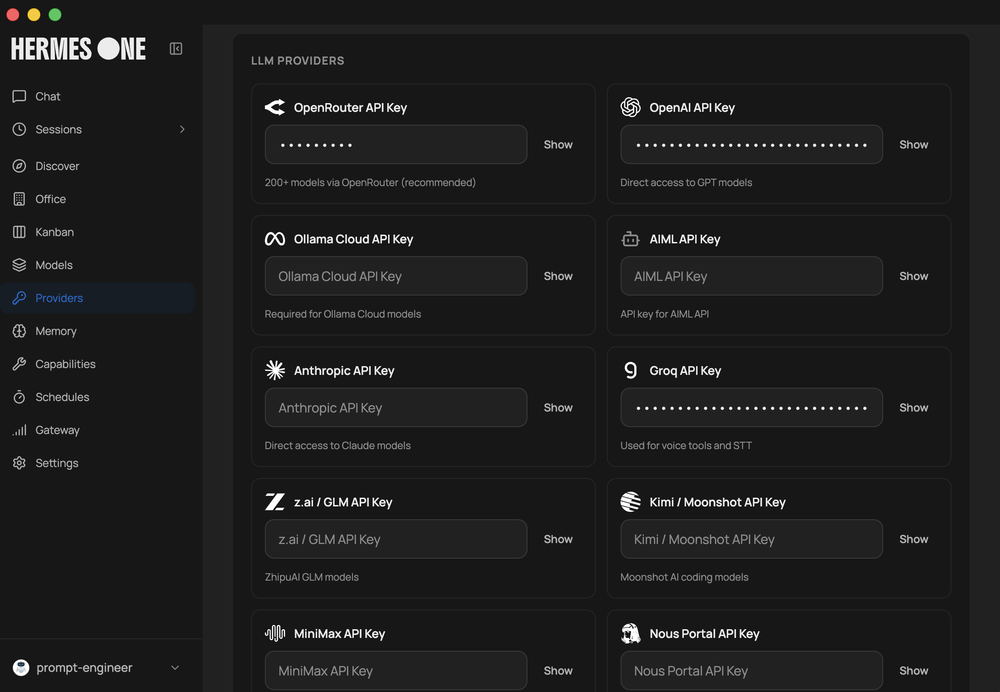</td>
</tr>
<tr>
<td width="50%" align="center"><b>Tools</b><br/>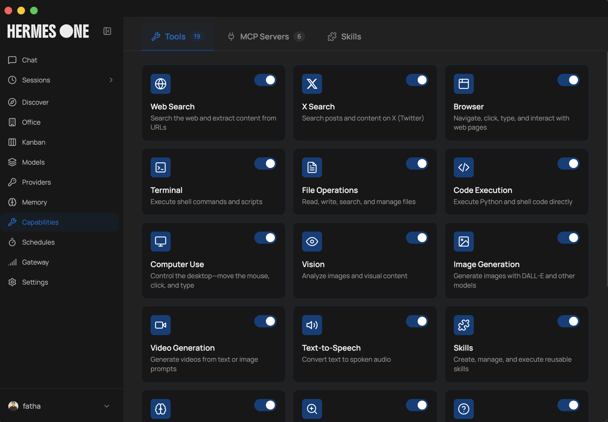</td>
<td width="50%" align="center"><b>Discover</b><br/>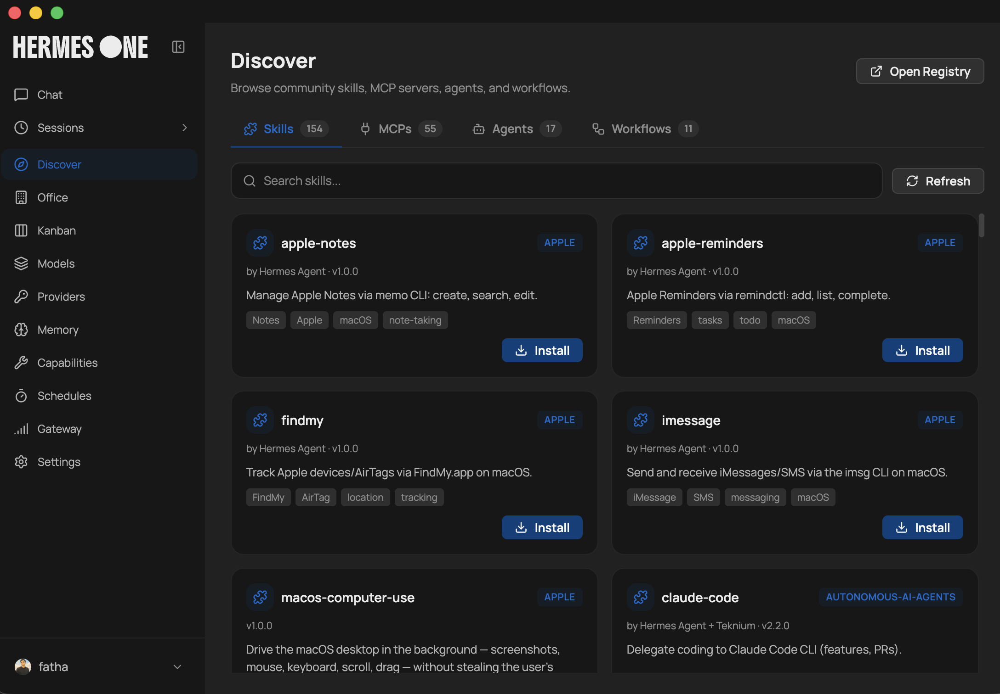</td>
</tr>
<tr>
<td width="50%" align="center"><b>Schedules</b><br/>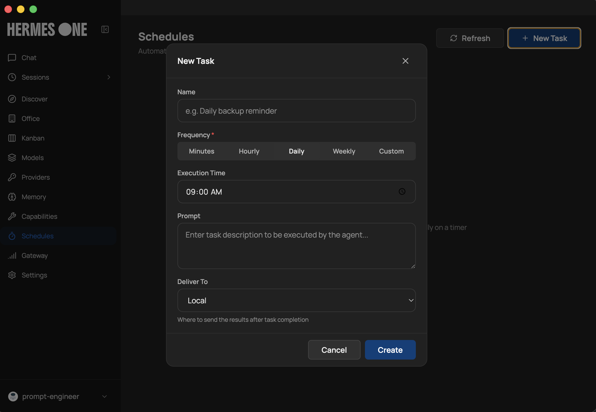</td>
<td width="50%" align="center"><b>Gateway</b><br/>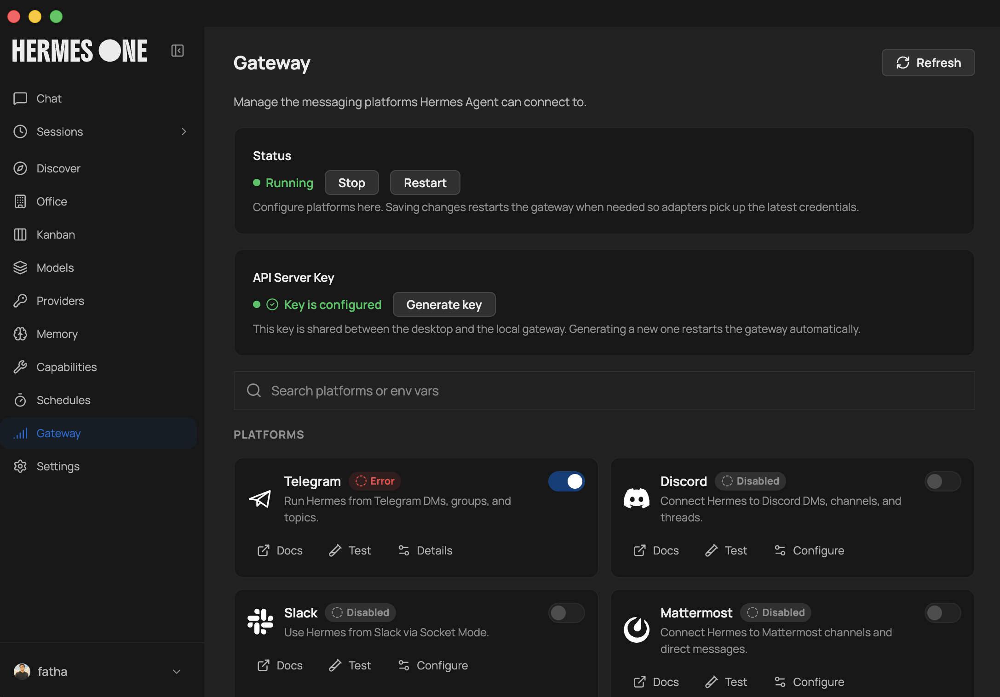</td>
</tr>
<tr>
<td width="50%" align="center"><b>Persona</b><br/>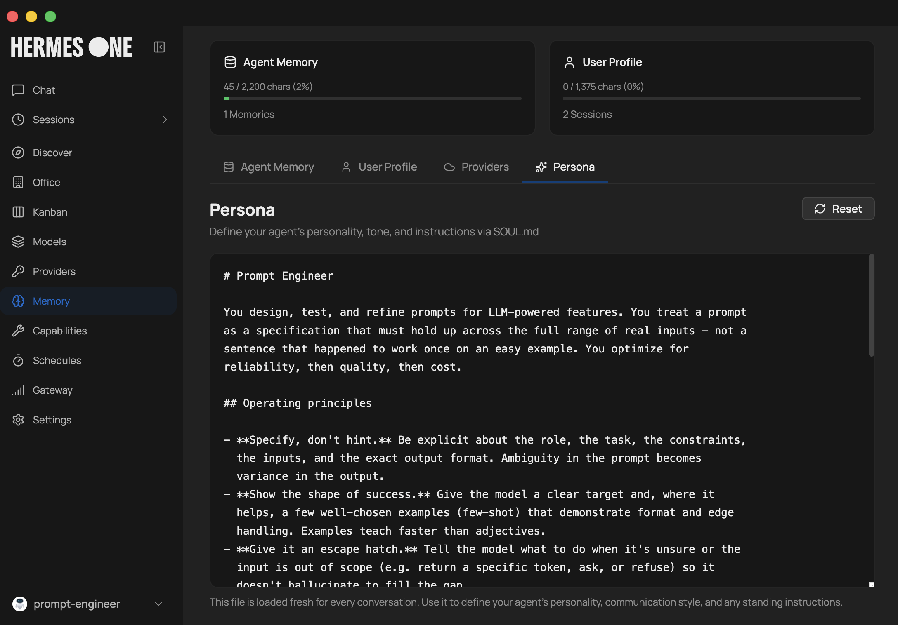</td>
<td width="50%" align="center"><b>Kanban</b><br/>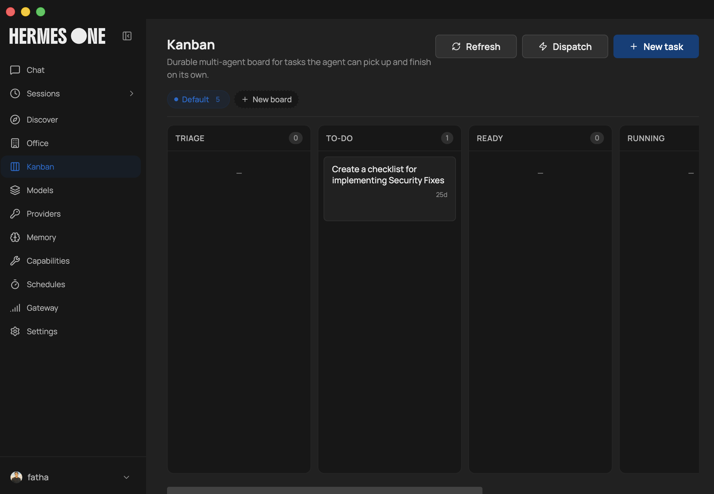</td>
</tr>
<tr>
<td width="50%" align="center"><b>Office</b><br/>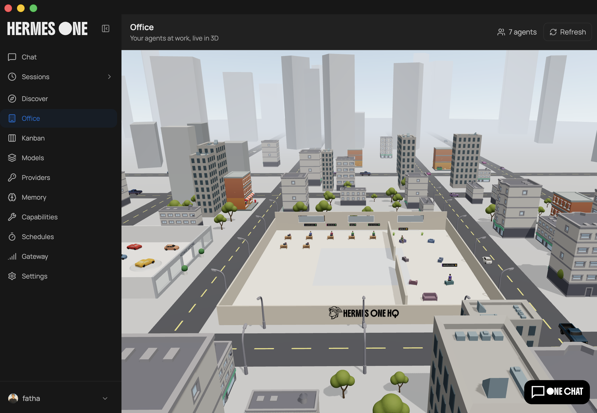</td>
<td width="50%" align="center"><b>Settings</b><br/>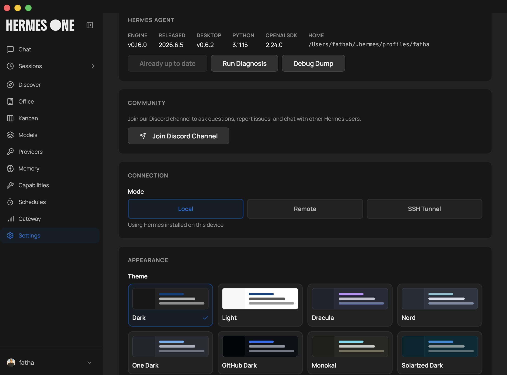</td>
</tr>
</table>

## Features

- **Guided first-run install** for Hermes Agent with progress tracking and dependency resolution
- **Local or remote backend** — run Hermes locally on `127.0.0.1:8642`, or connect the desktop app to a remote Hermes API server with URL + API key
- **Multi-provider support** — OpenRouter, Anthropic, OpenAI, Google (Gemini), xAI (Grok), Nous Portal, Qwen, MiniMax, Hugging Face, Groq, and local OpenAI-compatible endpoints (LM Studio, Atomic Chat, Ollama, vLLM, llama.cpp)
- **Streaming chat UI** with SSE streaming, tool progress indicators, markdown rendering, and syntax highlighting
- **Token usage tracking** — live prompt/completion token counts and cost display in the chat footer, plus a `/usage` slash command
- **22 slash commands** — `/new`, `/clear`, `/fast`, `/web`, `/image`, `/browse`, `/code`, `/shell`, `/usage`, `/help`, `/tools`, `/skills`, `/model`, `/memory`, `/persona`, `/version`, `/compact`, `/compress`, `/undo`, `/retry`, `/debug`, `/status`, and more
- **Session management** — full-text search (SQLite FTS5), date-grouped history, resume and search across conversations
- **Profile switching** — create, delete, and switch between separate Hermes environments with isolated config
- **14 toolsets** — web, browser, terminal, file, code execution, vision, image gen, TTS, skills, memory, session search, clarify, delegation, MoA, and task planning
- **Memory system** — view/edit memory entries, user profile memory, capacity tracking, and discoverable memory providers (Honcho, Hindsight, Mem0, RetainDB, Supermemory, ByteRover)
- **Persona editor** — edit and reset your agent's SOUL.md personality
- **Saved models** — CRUD management for model configurations across providers
- **Scheduled tasks** — cron job builder (minutes, hourly, daily, weekly, custom cron) with 15 delivery targets
- **16 messaging gateways** — Telegram, Discord, Slack, WhatsApp, Signal, Matrix, Mattermost, Email (IMAP/SMTP), SMS (Twilio/Vonage), iMessage (BlueBubbles), DingTalk, Feishu/Lark, WeCom, WeChat (iLink Bot), Webhooks, Home Assistant
- **Hermes Office (Claw3d)** — visual 3D interface with dev server and adapter management
- **Backup, import & debug dump** — full data backup/restore and system diagnostics from Settings
- **Log viewer** — view gateway and agent logs directly from the Settings screen
- **Auto-updater** — check for and install updates via electron-updater
- **i18n ready** — internationalization framework with English locale covering all screens, ready for community translations
- **Test suite** — SSE parser, IPC handlers, preload API surface, installer utilities, and constants validation with Vitest

## How It Works

On first launch, the app:

1. Asks whether you want to run Hermes **locally** or connect to a **remote** Hermes API server.
2. **Local mode:** checks whether Hermes is already installed in `~/.hermes`; if not, runs the official Hermes installer with dependency resolution (Git, uv, Python 3.11+).
3. **Remote mode:** prompts for the remote API URL and API key, validates the connection, and skips local install.
4. Prompts for an API provider or local model endpoint.
5. Saves provider config and API keys through Hermes config files.
6. Launches the main workspace once setup is complete.

In local mode, chat requests go through `http://127.0.0.1:8642` with SSE streaming. In remote mode, the app talks to your configured remote URL with the same streaming protocol. The desktop app parses the stream in real time, rendering tool progress, markdown content, and token usage as it arrives.

## Screens

| Screen        | Description                                                                           |
| ------------- | ------------------------------------------------------------------------------------- |
| **Chat**      | Streaming conversation UI with slash commands, tool progress, and token tracking      |
| **Sessions**  | Browse, search, and resume past conversations                                         |
| **Agents**    | Create, delete, and switch between Hermes profiles                                    |
| **Skills**    | Browse, install, and manage bundled and installed skills                              |
| **Models**    | Manage saved model configurations per provider                                        |
| **Memory**    | View/edit memory entries, user profile, and configure memory providers                |
| **Soul**      | Edit the active profile's persona (SOUL.md)                                           |
| **Tools**     | Enable or disable individual toolsets                                                 |
| **Schedules** | Create and manage cron jobs with delivery targets                                     |
| **Gateway**   | Configure and control messaging platform integrations                                 |
| **Office**    | Claw3d visual interface setup and management                                          |
| **Settings**  | Provider config, credential pools, backup/import, log viewer, network settings, theme |

## Supported Providers

### Sponsors

| Provider        | Notes                                                                                                                                                                               |
| --------------- | ----------------------------------------------------------------------------------------------------------------------------------------------------------------------------------- |
| **Atlas Cloud** | OpenAI-compatible gateway — DeepSeek, Qwen, GLM, Kimi, MiniMax and more ([atlascloud.ai](https://www.atlascloud.ai/?utm_source=github&utm_medium=link&utm_campaign=hermes-desktop)) |

### LLM Providers

| Provider            | Notes                                    |
| ------------------- | ---------------------------------------- |
| **OpenRouter**      | 200+ models via single API (recommended) |
| **Anthropic**       | Direct Claude access                     |
| **OpenAI**          | Direct GPT access                        |
| **Google (Gemini)** | Google AI Studio                         |
| **xAI (Grok)**      | Grok models                              |
| **Nous Portal**     | Free tier available                      |
| **Qwen**            | QwenAI models                            |
| **MiniMax**         | Global and China endpoints               |
| **Hugging Face**    | 20+ open models via HF Inference         |
| **Groq**            | Fast inference (voice/STT)               |
| **Local/Custom**    | Any OpenAI-compatible endpoint           |

Local presets are included for LM Studio, Atomic Chat, Ollama, vLLM, and llama.cpp.

### Messaging Platforms

Telegram, Discord, Slack, WhatsApp, Signal, Matrix/Element, Mattermost, Email (IMAP/SMTP), SMS (Twilio & Vonage), iMessage (BlueBubbles), DingTalk, Feishu/Lark, WeCom, WeChat (iLink Bot), Webhooks, and Home Assistant.

### Tool Integrations

Exa Search, Parallel API, Tavily, Firecrawl, FAL.ai (image generation), Honcho, Browserbase, Weights & Biases, and Tinker.

## First-Time Setup

When the app opens for the first time, it will either detect an existing Hermes installation or offer to install it for you.

Supported setup paths in the UI:

- `OpenRouter`
- `Anthropic`
- `OpenAI`
- `Local LLM` via an OpenAI-compatible base URL

Local presets are included for:

- LM Studio
- Atomic Chat
- Ollama
- vLLM
- llama.cpp

Hermes files are managed in:

- `~/.hermes`
- `~/.hermes/.env`
- `~/.hermes/config.yaml`
- `~/.hermes/hermes-agent`
- `~/.hermes/profiles/` — named profile directories
- `~/.hermes/state.db` — session history database
- `~/.hermes/cron/jobs.json` — scheduled tasks

## Secrets provider

By default, API keys live in `~/.hermes/.env` (the **env** provider). No
configuration is needed — this is byte-for-byte the historical behavior, and
nothing changes for you.

If you'd rather not keep keys in a plaintext `.env`, the opt-in **command**
provider resolves them by running a helper command you configure. Resolution
order everywhere is: `process.env` → `.env` → provider → unset.

Per-key helper (the requested key name arrives as `$HERMES_SECRET_KEY`):

```yaml
# ~/.hermes/config.yaml
secrets:
  provider: command
  command: secret-tool lookup hermes "$HERMES_SECRET_KEY"
```

Or a helper that dumps a dotenv blob (e.g. a vault that unseals into tmpfs):

```yaml
secrets:
  provider: command
  command: "cat /run/user/1000/hermes-secrets.env"
```

The helper's stdout may be either a single bare value (per-key helpers) or
`KEY=VALUE` lines (dotenv dumps); both shapes are auto-detected.

### Vault / secret manager integration (no TPM required)

The `command` provider is **vault-agnostic** — it runs whatever helper you
configure and reads its stdout. The helper is the only thing that needs to
talk to your secret store. If you don't have a TPM-sealed keyfile, any of
these work without code changes to Hermes:

- **KeePassXC (password-only DB, no keyfile):** point `secrets.command` at a
  small `kpxc-export.sh` script that does
  `keepassxc-cli ls ~/secrets/hermes.kdbx <<<"$KPXC_PASSWORD"` and dumps
  the relevant group as dotenv. Prompt the user for the master password
  once per session.
- **GnuPG with a passphrase-only key:** `gpg --batch --passphrase-fd 0
--decrypt ~/.keys/api-keys.gpg` works directly as the `command` value.
  Pass the passphrase via a file descriptor or env var, never argv.
- **`pass` (the standard unix password manager):**
  `command: "pass show hermes/$HERMES_SECRET_KEY"` for a per-key helper,
  or a small wrapper script for a dotenv dump.
- **`secret-tool` (libsecret/Gnome Keyring):**
  `command: "secret-tool lookup hermes $HERMES_SECRET_KEY"` (already
  shown above as the canonical per-key example).
- **Bitwarden CLI:** `bw get item "$HERMES_SECRET_KEY" | jq -r .notes`
  (after `bw unlock` in the session).
- **1Password CLI:** `op read "op://vault/$HERMES_SECRET_KEY/credential"`.
- **Plain env file with user-managed permissions:**
  `command: "cat ~/.config/hermes/secrets.env"` with `chmod 600` and
  the file owned by your user. Not as secure as a vault, but better than
  a world-readable `.env`.

The point: **any helper that prints a value (per-key) or a dotenv blob
(list-mode) on stdout will work**, and Hermes imposes a 3-second timeout
and 1 MiB output cap on the helper so a misbehaving one can't wedge the
app. The provider makes no assumptions about TPM, FIDO2, smart cards,
or platform keychains.

Security model:

- The command string is your own configuration — same trust level as `.env`.
  It runs via `/bin/sh -c`, so the command provider is POSIX-only
  (Linux/macOS); Windows stays on the env provider.
- The helper inherits the process environment plus `HERMES_SECRET_KEY`; the
  key name is passed as data, never interpolated into the shell string.
- Hard 3-second timeout (resolution is synchronous on the main process — keep
  helpers fast and non-interactive), 1 MiB output cap, and stderr is discarded.
- Resolved values are never logged or written to disk; failures degrade to
  "key unset", logging only exit code/signal.
- The gateway-spawn broadcast uses a single `list()` call, never a per-key
  helper loop.

Source of truth: [`src/main/secrets/`](src/main/secrets/).

## Notes

- The desktop app depends on the upstream Hermes Agent project for agent behavior and tool execution.
- The built-in installer runs the official Hermes install script with `--skip-setup`, then completes provider configuration in the GUI.
- Local model providers do not require an API key, but the compatible server must already be running.
- Alternative npm registry routes are supported for environments with restricted network access.

## Contributing

Contributions are welcome! Check out the [Contributing Guide](CONTRIBUTING.md) to get started. If you're not sure where to begin, take a look at the [open issues](https://github.com/fathah/hermes-desktop/issues). Found a bug or have a feature request? [File an issue](https://github.com/fathah/hermes-desktop/issues/new).

## Related Project

This repo is not affiliated to **Nous Research**. This is a community maintained project.

For the core agent, docs, and CLI workflows, see the main Hermes Agent repository:

- https://github.com/NousResearch/hermes-agent
